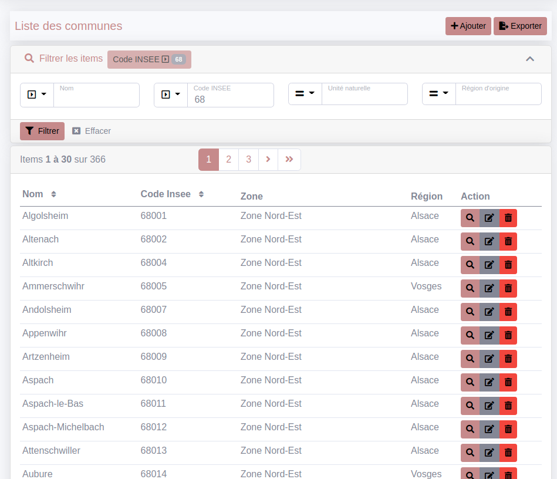
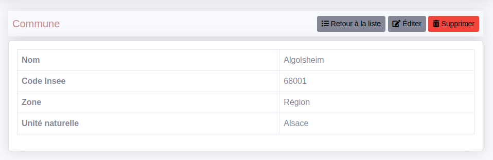
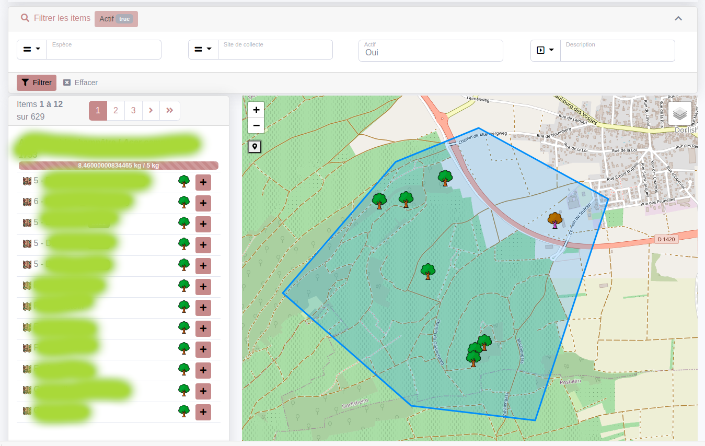

# CruditBundle


[](https://github.com/2lenet/CruditBundle/actions)
[](https://github.com/2lenet/CruditBundle/actions)

Crudit bundle for 2le.

## Installation

```composer require 2lenet/crudit-bundle```

## Principle

A crud is composed by 
- an independent controller
- a crud config class
- a datasource
- a filterset if needed

The layout and menu are independant from the crud. You can integrate easily you own controller in a Crudit Layout 

## Feature

### List view

The list view has the following features :
- Pagination
- Sorting
- Item Actions ( Show, Edit and Delete as standard )
- List Actions ( Add and Export csv and excel as standard )
- List grouping ( to save place in repeating values )
- Batch Action ( ( see [Sublist](doc/batch_action.md) ) )
- Layout customisation is possible ( doc TODO / Block principle )

The list view need a Datasource but is not bounded to Doctrine or any ORM.

### Show view

The show view has the following feature :
- Show all fields
- Title can use the entity to title the object by its name
- Tabs 
- Sublists to show related data ( see [Sublist](doc/sublist.md) )
- Layout customisation is possible ( doc TODO / Block principle )

### Form view

The edit view is a classical Symfony Form. You write your own FormType

Crudit provides some help to be nicely integrated :
- Many FormType ( Datetime, Entity, etc ...)
- Entity Dropdown based on TomSelect with autocomplete
- DoctrineFormGuesser to automatically use Crudit FormType.
- Layout customisation is possible ( doc TODO / Block principle )

### Maps
If you work with geographic data you can integrate it easily as Leaflet Map in Crudit Screen



The map Bloc can show Markers and Polylines.
You can provide your own Geojson datasource too.

Maps can be used in the list ( like the screenshot ) or in the show view to basically show the position of the object in a Tab, for example.

See [Add a map to a list or to a show](doc/map_config.md) for details

## Recipe

- [Submenu](doc/submenu.md)
- [Filters](doc/filter.md)
- [Sublist](doc/sublist.md)
- [Use a FilterSet in your own Controller](doc/filterset_controller.md)
- [Form types](doc/form_types.md)
- [Add a map to a list or to a show](doc/map_config.md)
- [How to export data](doc/export.md)


## Dependencies

Crudit wants to minimise dependencies on not really popular bundles or components
in order to be able to maintain this bundle for many years and to follow the Symfony Stack development without dependency problems.

The layout is inspired by sb-admin-2 but partially rewritten. Many of the features of sbAdmin wasn't useful for this project.

https://startbootstrap.com/theme/sb-admin-2 ( inspired from ).

The CSS framework used is Bootstrap5. ( It could be possible to change that without much difficulty ).

The map component uses Leaflet.

Excel export uses phpoffice/phpspreadsheet.

Doctrine is needed for the pre-version but the project is designed to work without it. Feel free to contact us if you want to use other dataprovider.


# Development

TO COMPLETE
- [Design principle ](doc/design.md)

## js / css Developpement

To update the JS or the CSS please run 

`npm install`

and 

`npm run build` or `npm run watch`

in the bundle
