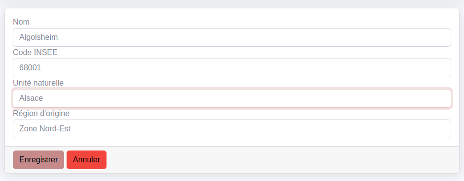

# CruditBundle


[](https://github.com/2lenet/CruditBundle/actions)
[](https://github.com/2lenet/CruditBundle/actions)

Crudit bundle for 2le.

## Installation

```composer require 2lenet/crudit-bundle```

## Principle

A crud is composed by 
- an independent controller
- a crud config class
- a datasource
- a filterset if needed

The layout and menu is independant from the crud. You can integrate easyly you own controller in a Crudit Layout 

## Feature

### List view

The list view has the following feature :
- pagination
- Sorting
- Item Actions ( Show, Edit and Delete as standard )
- List Actions ( Add and Export csv and excel as standard )
- List grouping ( to save place in repeating values )
- Batch Action ( doc TODO)
- Layout customisation is possible ( doc TODO / Block principle )

The list view need a Datasource but is not bounded to Doctrine or any ORM.

### Show view

The show view has the following feature :
- show all field.
- Title can use the entity to title the object by it's name
- Tabs 
- Sublists to show related data ( see [Sublist](doc/sublist.md) )
- Layout customisation is possible ( doc TODO / Block principle )

### Form view

The edit view is a classical Symfony Form. You write your own FormType

Crudit Provide some help to be nicely integrated :
- Many FormType ( Datetime, Entity, etc ...)
- Entity Dropdown based on TomSelect with autocomplete
- DoctrineFormGuesser to automaticly use Crudit FormType.
- Layout customisation is possible ( doc TODO / Block principle )

### Maps
If you work with geographic data you can integrate it easyly as Leaflet Map in Crudit Screen


The map Bloc can show Markers and Polylines
You can provide your own Geojson datasource to.

Maps can be used in the list ( like the screenshot ) or in the show view to basically show the position of the object in an Tab for exemple.

See [Add a map to a list or to a show](doc/map_config.md) for details

## Recipe

- [Submenu](doc/submenu.md)
- [Filters](doc/filter.md)
- [Sublist](doc/sublist.md)
- [Use a FilterSet in your own Controller](doc/filterset_controller.md)
- [Form types](doc/form_types.md)
- [Add a map to a list or to a show](doc/map_config.md)
- [How to export data](doc/export.md)


## Dependency

Crudit want to minimise dependency on not really popular bundle or components
This is to be able to maintain this bundle for many years and to follow the Symfony Stack developpement without dependency problems.

The layout is inspired by sb-admin-2 but partially rewriten. A lot of feature of sbAdmin wasn't usefull for this project.

https://startbootstrap.com/theme/sb-admin-2 ( inspired from )

The CSS framework used is Bootstrap5. ( It could be possible to change that without much difficulties )

The map component use Leaflet

Excel export use phpoffice/phpspreadsheet

Doctrine is needed for the preversion but the project is designed to work without it. Feel free to contact us if you want to use other dataprovider.


# Developpement

TO COMPLETE
- [Design principle ](doc/design.md)

## js / css Developpement

To update the JS or the CSS please run 

`npm install`

and 

`npm run build` or `npm run watch`

in the bundle
