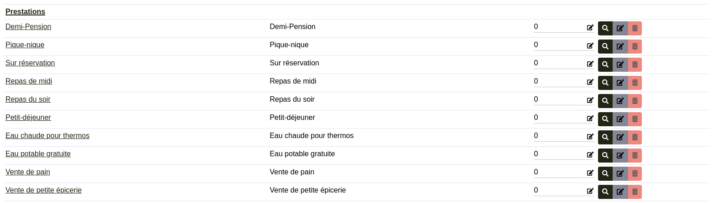

Crudit RuptGroup 

### Usage
A RuptGroup is used to group entities together by relationship.
It can be activated in the following way, provided that the target field is a relationship, and all you have to do to activate it is pass it the value 1:

```php
$groupeTypeAttribut = Field::new('groupeTypeAttribut')->setRuptGroup(1);
```
And it's done !

### Result

Here is an example


