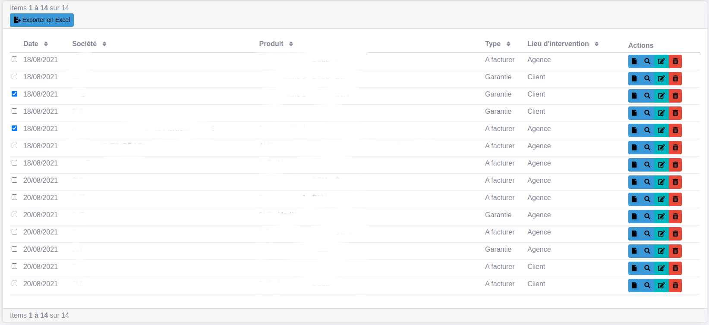

# How to add batch actions in your list

The batch actions allow to perform a given action on the pre-selected items of the list.

In your src/Crudit/Config/EntityCrudConfig.php, you have to overload the getListActions() method of the 
AbstractCrudConfig. Inside you getListActions() method, you can add a new action and add ```->setIsBatch()``` to it:
```php
    public function getListActions(): array
    {
        $actions =  parent::getListActions();
        
        $actions[] = ListAction::new(
                'action.batch.exporter',
                Path::new('exporter_intervention'),
                Icon::new('file-export')
            )->setIsBatch();
            
        return $actions;           
    }
```

Then, in your src/Controller/Crudit/EntityContoller.php you can write the method that the batch action is going to execute:
```php
    /**
     * @Route("/exporter_intervention", name="exporter_intervention")
     */
    public function exporterInterventions(Request $request, ResourceResolver $resolver, Exporter $exporter)
    {
        $ids = explode(",", $request->get("ids"));
        
        ...
    }
```

This will result in:



That's it!
