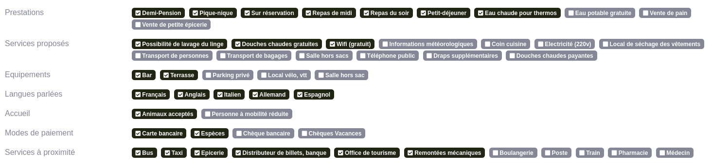

## Tags

First of all, you need to implement the brick in your CrudConfig file, in the `getTabs` method for exemple.

To do this, you need to pass 2 parameters, the datasource where you will put the method for retrieving the data and the route that you will use to modify the tags linked to your object.

```php
use Lle\CruditBundle\Brick\TagBrick\TagConfig;

// ...

public function getTabs(): array
{
    return [
        'tab.tags' => TagConfig::new($this->getDatasource(), 'app_crudit_refuge_addtag'),
    ];
}
```

You can pass 2 optionals parameters, which are the role for editing tags and the method of your datasource (1st params) that will be used to retrieve the data (default: `getTags()`).

> This method receive a `id` params who's typed in `int|string`

```php
public function getTabs(): array
{
    return [
        'tab.tags' => TagConfig::new($this->getDatasource(), 'app_crudit_refuge_addtag', 'ROLE_TOTO', 'getSpecialTags'),
    ];
}
```

The next step is to configure the `getTags()` method (or another if you've overridden it) in your datasource to get the data you want.

You need to return an array with 2 keys, `tags` (the list of available tags) and `currentTags` (the tags currently linked to your object).

```php
public function getTags(object $resource): iterable
{
    $tags = $this->entityManager->getRepository(YourTagEntity::class)->findAll();
    $currentTags = $this->entityManager->getRepository(YourEntity)->findBy(['your_field' => $resource]); // you can also use the getter on your resource
    
    return ['tags' => $tags, 'currentTags' => $currentTags];
}
```

You can also group these tags by category as follows.

```php
public function getTags(object $resource): iterable
{
    $groupedTags = [];
    $tags = $this->entityManager->getRepository(YourTagEntity::class)->findAll();
    foreach ($tags as $tag) {        
        $groupedTags[$tag->getCategory()][] = $tag;
    }
    
    // ...
    
    return ['tags' => $groupedTags, 'currentTags' => $currentTags]
}
```

Finally, you need to create the route that will be used to save the changes, create a link between your object and the tag or delete it.

Two parameters are passed to the route, the id of your object and the id of the tag clicked.

Like the 'edit in place', this route will be called up asynchronously.

```php
#[Route('/add-tag/{id}/{tag}')]
public function addTag(YourEntity $entity, YourTagEntity $tag): JsonResponse
{
    $link = $this->em->getRepository(LinkedEntity::class)->findOneBy(['your_entity' => $entity, 'tag' => $tag]);
    if ($link) {
        $this->em->remove($link);
    } else {
        $link = new Link();
        $link
            ->setYourEntity($entity)
            ->setTag($tag);
            
        $this->em->persist($link);
    }
    
    $this->em->flush();
    
    return new JsonResponse();
}
```

This will result in:



Now you have an interactive tab with your tags and you can edit them as you like !
