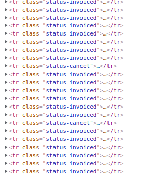
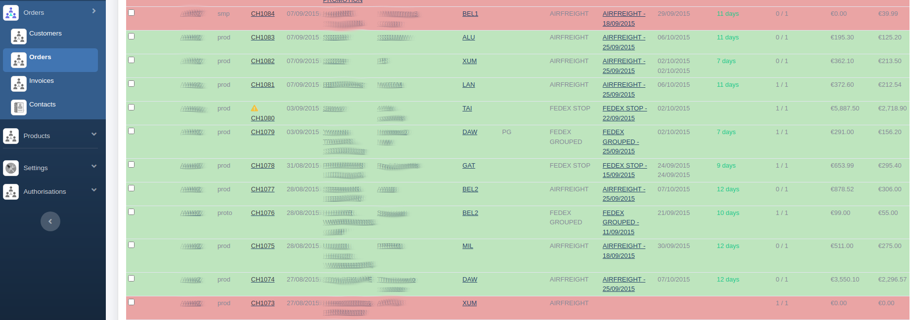

# How to color the rows of a list

Crudit allows you to add a class to `<tr>` tags in lists.

To do so, go to the entity corresponding to your list and add a new getter:

```php
    public function getCssClass(): string
    {
        return 'status-' . $this->status;      
    }
```

If you refresh your list and got to your code inspector, you will see that a class has been added to `<tr>` tags:



All you have to do next is go to the CSS of your project and apply a background color to this new class:

```css
.status-invoiced {
  background-color: darkseagreen;
}

.status-cancel {
  background-color: indianred;
}
```



> :warning: **With Bootstrap ^5.2, you need to override the css variable to transparent.**

```scss
$table-bg: transparent;
```
