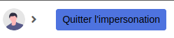

# Config

We have several configurations available to manage different functionalities.

**1. CRUD**

We have three configurations for managing the alignment of numbers with three possible values: left, center and right:
- `default_currency_alignment`
- `default_integer_alignment`
- `default_number_alignment`

**2. Actions**

There are two different configurations for managing the display of actions (possible values: true/false):
- `hide_if_disabled`
- `delete_hide_if_disabled`

**3. Others**

These configurations manage the features in your application header.

`add_connect_profile_link` add a button to access your profile page.

You must have a `connect_url` variable in your `twig.yaml` file like this:

```yaml
twig:
    globals:
        connect_url: '%env(CONNECT_URL)%'
```


`add_exit_impersonation_button` add a button to the header if you are impersonating someone.

`exit_impersonation_path` manages the url to which you will be redirected after exiting impersonation (default: `homepage`).


