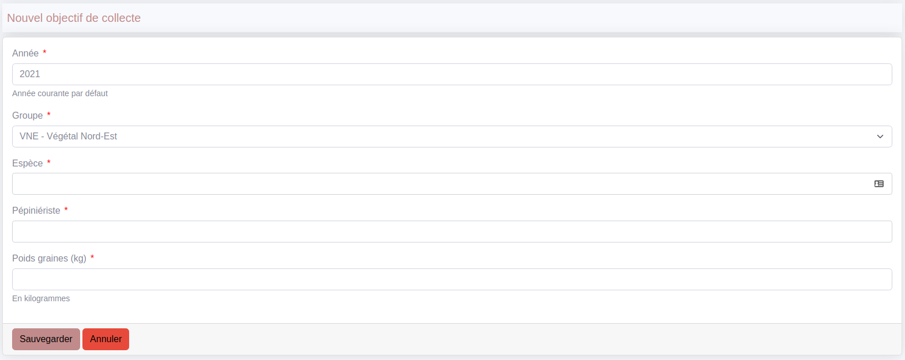
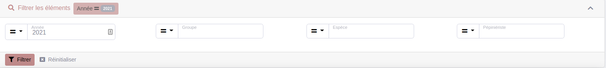

    }
```

### How to sort your list:

```php
  public function getDefaultSort(): array
    {
        return [['numeroLot', 'ASC']];
    }
```

### How to add actions:

It is possible to add actions to lists, list items and shows.

```php
  public function getListActions(): array
  {
      $res[] = ListAction::new(
          "action.export",
          $this->getPath(CrudConfigInterface::EXPORT),
          Icon::new("file-export")
      )
          ->setModal("@LleCrudit/modal/_export.html.twig")
          ->setConfig(
              [
                  "export" => [Exporter::CSV, Exporter::EXCEL],
              ]
          );
          
      $res[] = ListAction::new(
          'action.import.csv',
          Path::new('import_lot_melange'),
          Icon::new('download')
      );

      $res[] = ListAction::new(
          'action.batch.bons_livraisons',
          Path::new('create_bons_livraisons'),
          Icon::new('truck-loading')
      )->setIsBatch();

      return $res;
  }
```

## Write actions that will be executed in your crud

When we declare a new action in our page, we indicate the path of our method. This method must be in
```src/Controller/Crudit/EntityController.php```:

## Configure the form to be displayed in the new and edit screens

In ```src/Form/EntityType.php```. The form is a basic Symfony form. Several formtypes are available. See : [Form types](form_types.md)



## Configure the filters in your list

In  ```src/Crudit/Datasource/Filterset/EntityFilterSet.php```. See [Filters](filter.md)



> :warning: **Don't forget to add your new crud to the menu in src/Crudit/CrudMenu/AppMenuProvider.php:**

```php
LinkElement::new(
    'menu.groupes',
    Path::new('app_crudit_contact_index'),
    Icon::new('/img/icons/contact.svg', Icon::TYPE_IMG),
    "ROLE_CONTACT_INDEX"
)
```
