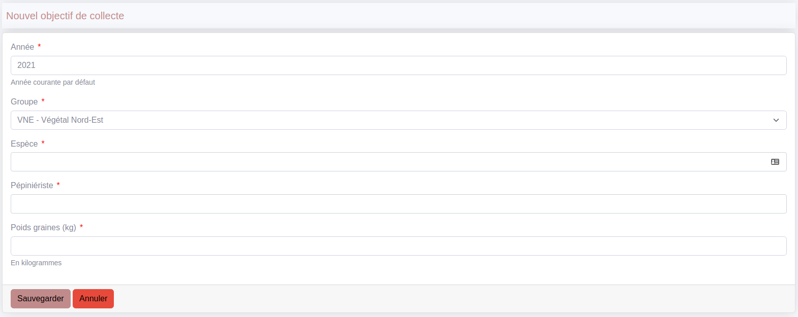
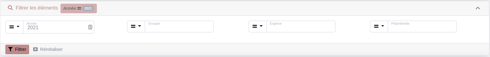

To create a crud, simply type this command in the console of your project:

```php bin/console make:crudit```

You will then be asked a series of questions :

- the name of your Entity
- the namespace of your Controller
- if the command should also create filters related to your entity's fields

That's it! Several files have been created:

- ```src/Crudit/Config/EntityCrudConfig.php```
- ```src/Controller/Crudit/EntityController.php```
- ```src/Form/EntityType.php```
- ```src/Crudit/Datasource/Filterset/EntityFilterSet.php```
- ```src/Crudit/Datasource/EntityDatasource.php```

## How to sort your list:

```php
  public function getDefaultSort(): array
    {
        return [['numeroLot', 'ASC']];
    }
```

## How to configure the choices of the number of items to display:

```php
  public function getChoicesNbItems(): array
  {
      return [15, 30, 45, 60];
  }
```

## How to add actions:

It is possible to add actions to lists, list items and shows.
It is already possible to add action in a dropdown, adding `->setDropdown(true)` to the action object.

```php
  public function getListActions(): array
  {
      $res[] = ListAction::new(
          "action.export",
          $this->getPath(CrudConfigInterface::EXPORT),
          Icon::new("file-export")
      )
          ->setModal("@LleCrudit/modal/_export.html.twig")
          ->setConfig(
              [
                  "export" => [Exporter::CSV, Exporter::EXCEL],
              ]
          );
          
      $res[] = ListAction::new(
          'action.import.csv',
          Path::new('import_lot_melange'),
          Icon::new('download')
      )->setDropdown(true);

      $res[] = ListAction::new(
          'action.batch.bons_livraisons',
          Path::new('create_bons_livraisons'),
          Icon::new('truck-loading')
      )->setIsBatch();

      return $res;
  }
```

If you want to add a role for your action:

```php
  public function getListActions(): array
  {          
      $res[] = ListAction::new(
          'action.import.csv',
          (Path::new('import_lot_melange'))->setRole('ROLE_IMPORT'),
          Icon::new('download')
      )->setDropdown(true);

      return $res;
  }
```

## How to display the action under certain conditions

You can add conditions to actions, using the resource or not, in order to decide whether to display the action based on the data.

To do this, simply use the method `setDisplayCallable`:

```php
$actions[CrudConfigInterface::ACTION_SHOW] = ItemAction::new(
    'action.show',
    $this->getPath(CrudConfigInterface::SHOW),
    Icon::new('search')
)
    ->setCssClass('btn btn-primary btn-sm crudit-action')
    ->setRole(sprintf('ROLE_%s_%s', $this->getName(), CrudConfigInterface::SHOW))
    ->setDisplayCallable(fn(Resource $resource) => $resource->isActive());
```

## Write actions that will be executed in your crud

When we declare a new action in our page, we indicate the path of our method. This method must be in
```src/Controller/Crudit/EntityController.php```

## Configure the form to be displayed in the new and edit screens

In ```src/Form/EntityType.php```. The form is a basic Symfony form. Several formtypes are available.
See : [Form types](form_types.md)



## Configure the filters in your list

In  ```src/Crudit/Datasource/Filterset/EntityFilterSet.php```. See [Filters](filter.md)



## Enable striped tables

To enable striped tables in the lists, you must add this scss :

```scss
.crudit-list {
    & > tbody > tr:nth-of-type(odd) {
        --#{$variable-prefix}table-accent-bg: var(--#{$variable-prefix}table-striped-bg);
        color: var(--#{$variable-prefix}table-striped-color);
    }
}
```

> :warning: **Don't forget to add your new crud to the menu in src/Crudit/CrudMenu/AppMenuProvider.php:**

```php
LinkElement::new(
    'menu.groupes',
    Path::new('app_crudit_contact_index'),
    Icon::new('/img/icons/contact.svg', Icon::TYPE_IMG),
    "ROLE_CONTACT_INDEX"
)
```

## How to add totals on your list:

It is possible to add totals to your list by adding the `getTotalsFields` method to the CrudConfig file.

```php
public function getTotalFields(): array
{
    return [
        'montantHt' => [
            'type' => CrudConfigInterface::SUM,
            'field' => Field::new('montantHt', 'currency'),
        ],
        'montantTtc' => [
            'type' => CrudConfigInterface::SUM,
            'field' => Field::new('montantTtc', 'currency'),
        ],
    ];
}
```

You can choose between 3 types of totals, `AVERAGE`, `SUM` and `COUNT`.
To use them, use the constants defined in the `CrudConfigInterface` file.

> :warning: **Don't forget to specify the type of your field, as Crudit is unable to determine this itself.**

## Configure route for DoctrineEntityField

To configure route for DoctrineEntityField, you must set the `route` options:

```php
Field::new('yourdoctrinentityfield', null, ['route' => 'your_route']);
```

Or:

```php
Field::new('yourdoctrinentityfield')->setOptions(['route' => 'your_route']);
```

## Configure autocomplete route for DoctrineEntityField

To configure autocomple route for DoctrineEntityField, you must set the `setAutocompleteUrl` method:

```php
Field::new('yourdoctrinentityfield')->setAutocompleteUrl('your_autocomplete_url');
```

If you want to be able to select several items, you need to add the `setMultiple` method:

```php
Field::new('yourdoctrinentityfield')->setAutocompleteUrl('your_autocomplete_url')->setMultiple(true);
```

## Configure role for DoctrineEntityField

If you want to add a role for your DoctrineEntityField:

```php
Field::new('yourdoctrinentityfield', null, ['route' => 'your_route', 'routeRole' => 'YOUR_ROLE']);
```

Or:

```php
Field::new('yourdoctrinentityfield')->setOptions(['route' => 'your_route', 'routeRole' => 'YOUR_ROLE']);
```

## How to refresh field on your list after using editInPlace:

It is possible to refresh the value of a field in a list/show/sublist after modifying one using the `fieldsToUpdate` method.
To do this, you need to return an array containing each id of the element you want to refresh and the HTML code contained in that element.

The id of the element contain a part call **'yourfieldlabel'**, if the label of your field start with 'field.' or 'label.', Crudit automatically remove it.
So if you've 'field.toto', 'yourefieldlabel' must be 'toto' but if you've 'text.toto' you'll have 'text.toto'.

```php
public function fieldsToUpdate(int|string $id): array
{
    $result = $this->em->getRepository(YourEntity::class)->find($id);

    if (!$result) {
        return [];
    }

    return [
        'sublist-yourentity-' . $result->getId() . '-yourfieldid-yourfieldlabel' => $this->twig->render('the/template.html.twig', [
            'view' => [
                'field' => Field::new('yourfield')->setEditable('app_crudit_your_entity_editdata')
            ],
            'resource' => $result,
            'value' => $result->getYourField(),
            'options' => [
                "tableCssClass" => "text-end",
                'decimals' => '2',
                'decimal_separator' => ',',
                'thousands_separator' => ' ',
            ],
        ]),
    ];
}
```

> :warning: **If you refresh a field which is also an editInPlace, you need to configure the `eipToUpdate` method to re-enable the edit capability.**

```php
public function eipToUpdate(int|string $id): array
{
    $result = $this->em->getRepository(YourEntity::class)->find($id);

    if (!$result) {
        return [];
    }

    return [
        'sublist-yourentity-' . $result->getId() . '-yourfieldid-yourfieldlabel',
    ];
}
```

## How to auto refresh the page:

It is possible to auto refresh the page for the list and/or the show using the `getListAutoRefresh`/`getShowAutoRefresh` methods.
To do this, you need to return an integer that corresponds to the time interval (in seconds) between 2 refreshes.

```php
public function getListAutoRefresh(): ?int
{
    return 60;
}

public function getShowAutoRefresh(): ?int
{
    return 60;
}
```

## How to configure field groups in the show brick

If you have a lot of information to put in your show brick, you can divide it into several groups, which will create several expandable elements (open by default).

```php
public function getFields(string $key): array
{
    switch ($key) {
        case CrudConfigInterface::SHOW:
            $fields = [
                'title.group1' => [
                    $field1,
                    $field2,
                    $field3,
                ],
                'title.group2' => [
                    $field4,
                    $field5,
                ],
            ];
            break;
    }
}
```

You can configure the number of field groups opened by default using the `getShowNumberFieldGroupsOpened` method.

```php
public function getShowNumberFieldGroupsOpened(): ?int
{
    return 2;
}
```
