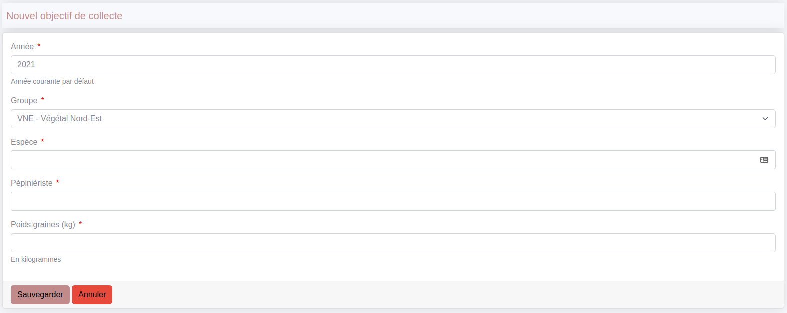
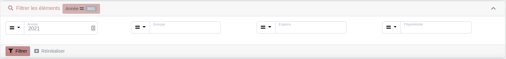

To create a crud, simply type this command in the console of your project:

```php bin/console make:crudit```

You will then be asked a series of questions :

- the name of your Entity
- the namespace of your Controller
- if the command should also create filters related to your entity's fields

That's it! Several files have been created:

- ```src/Crudit/Config/EntityCrudConfig.php```
- ```src/Controller/Crudit/EntityController.php```
- ```src/Form/EntityType.php```
- ```src/Crudit/Datasource/Filterset/EntityFilterSet.php```
- ```src/Crudit/Datasource/EntityDatasource.php```

## How to sort your list:

```php
  public function getDefaultSort(): array
    {
        return [['numeroLot', 'ASC']];
    }
```

## How to change the default sorting of your autocomplete route

```php
public function getDefaultAutocompleteSort(): ?array
{
    return [['label', 'ASC']];
}
```

## How to configure the choices of the number of items to display:

```php
  public function getChoicesNbItems(): array
  {
      return [15, 30, 45, 60];
  }
  
  
```

## How to configure cssClass for a field in a card:

Use `setCardCssClass` on a field to apply a CSS class to it in the card view.

```php
Field::new('myField')->setCardCssClass('col-md-6');
```

## How to add actions:

It is possible to add actions to lists, list items and shows.
It is already possible to add action in a dropdown, adding `->setDropdown(true)` to the action object.

```php
  public function getListActions(): array
  {
      $res[] = ListAction::new(
          "action.export",
          $this->getPath(CrudConfigInterface::EXPORT),
          Icon::new("file-export")
      )
          ->setModal("@LleCrudit/modal/_export.html.twig")
          ->setConfig(
              [
                  "export" => [Exporter::CSV, Exporter::EXCEL],
              ]
          );
          
      $res[] = ListAction::new(
          'action.import.csv',
          Path::new('import_lot_melange'),
          Icon::new('download')
      )->setDropdown(true);

      $res[] = ListAction::new(
          'action.batch.bons_livraisons',
          Path::new('create_bons_livraisons'),
          Icon::new('truck-loading')
      )->setIsBatch();

      return $res;
  }
```

If you want to add a role for your action:

```php
  public function getListActions(): array
  {          
      $res[] = ListAction::new(
          'action.import.csv',
          (Path::new('import_lot_melange'))->setRole('ROLE_IMPORT'),
          Icon::new('download')
      )->setDropdown(true);

      return $res;
  }
```

## How to display the action under certain conditions

You can add conditions to actions, using the resource or not, in order to decide whether to display the action based on the data or the request.

To do this, simply use `setDisplayIf` (for the data) or `setDisplayIfByRequest` (for the request):

```php
$actions[CrudConfigInterface::ACTION_SHOW] = ItemAction::new(
    'action.show',
    $this->getPath(CrudConfigInterface::SHOW),
    Icon::new('search')
)
    ->setCssClass('btn btn-primary btn-sm crudit-action')
    ->setRole(sprintf('ROLE_%s_%s', $this->getName(), CrudConfigInterface::SHOW))
    ->setDisplayIf(fn(Resource $resource) => $resource->isActive())
    ->setDisplayIfByRequest(fn(Request $request) => $request->query->has('actif'));
```

You can configure editable conditions on ```lle\src\Dto\Field``` by adding
```php
 Field::new()->setEditInPlace(true)->setEditableIf(callback) 
```

## Write actions that will be executed in your crud

When we declare a new action in our page, we indicate the path of our method. This method must be in
```src/Controller/Crudit/EntityController.php```

## Configure the form to be displayed in the new and edit screens

In ```src/Form/EntityType.php```. The form is a basic Symfony form. Several formtypes are available.
See : [Form types](form_types.md)



## Configure the filters in your list

In  ```src/Crudit/Datasource/Filterset/EntityFilterSet.php```. See [Filters](filter.md)



## Enable striped tables

To enable striped tables in the lists, you must add this scss :

```scss
.crudit-list {
    & > tbody > tr:nth-of-type(odd) {
        --#{$variable-prefix}table-accent-bg: var(--#{$variable-prefix}table-striped-bg);
        color: var(--#{$variable-prefix}table-striped-color);
    }
}
```

> :warning: **Don't forget to add your new crud to the menu in src/Crudit/CrudMenu/AppMenuProvider.php:**

```php
LinkElement::new(
    'menu.groupes',
    Path::new('app_crudit_contact_index'),
    Icon::new('/img/icons/contact.svg', Icon::TYPE_IMG),
    "ROLE_CONTACT_INDEX"
)
```

## How to add totals on your list:

It is possible to add totals to your list by adding the `getTotalsFields` method to the CrudConfig file.

```php
public function getTotalFields(): array
{
    return [
        'montantHt' => [
            'type' => CrudConfigInterface::SUM,
            'field' => Field::new('montantHt', 'currency'),
        ],
        'montantTtc' => [
            'type' => CrudConfigInterface::SUM,
            'field' => Field::new('montantTtc', 'currency'),
        ],
    ];
}
```

You can choose between 3 types of totals, `AVERAGE`, `SUM` and `COUNT`.
To use them, use the constants defined in the `CrudConfigInterface` file.

For computed totals that combine several columns, use `EXPRESSION` and provide a raw DQL expression:

```php
public function getTotalFields(): array
{
    return [
        'totalAmount' => [
            'type' => CrudConfigInterface::SUM,
            'field' => Field::new('totalAmount', 'currency'),
        ],
        'grossMargin' => [
            'type' => CrudConfigInterface::EXPRESSION,
            'expression' => 'SUM(root.totalAmount) - SUM(root.supplierCost)',
            'field' => Field::new('grossMargin', 'currency'),
        ],
    ];
}
```

`EXPRESSION` totals are also computed per group when `withSubtotals()` is used.

> :warning: **Don't forget to specify the type of your field, as Crudit is unable to determine this itself.**

You can also use totals on your sublist by adding `getSubListTotalFields` method to the CruditConfig file.
## Configure route for DoctrineEntityField

To configure route for DoctrineEntityField, you must set the `route` options:

```php
Field::new('yourdoctrinentityfield', null, ['route' => 'your_route']);
```

Or:

```php
Field::new('yourdoctrinentityfield')->setOptions(['route' => 'your_route']);
```

## Configure autocomplete route for DoctrineEntityField

To configure autocomple route for DoctrineEntityField, you must set the `setAutocompleteUrl` method:

```php
Field::new('yourdoctrinentityfield')->setAutocompleteUrl('your_autocomplete_url');
```

If you want to be able to select several items, you need to add the `setMultiple` method:

```php
Field::new('yourdoctrinentityfield')->setAutocompleteUrl('your_autocomplete_url')->setMultiple(true);
```

## Configure role for DoctrineEntityField

If you want to add a role for your DoctrineEntityField:

```php
Field::new('yourdoctrinentityfield', null, ['route' => 'your_route', 'routeRole' => 'YOUR_ROLE']);
```

Or:

```php
Field::new('yourdoctrinentityfield')->setOptions(['route' => 'your_route', 'routeRole' => 'YOUR_ROLE']);
```

## How to refresh field on your list after using editInPlace:

It is possible to refresh the value of a field in a list/show/sublist after modifying one using the `fieldsToUpdate` method.
To do this, you need to return an array containing each id of the element you want to refresh and the HTML code contained in that element.

The id of the element contain a part call **'yourfieldlabel'**, if the label of your field start with 'field.' or 'label.', Crudit automatically remove it.
So if you've 'field.toto', 'yourefieldlabel' must be 'toto' but if you've 'text.toto' you'll have 'text.toto'.

```php
public function fieldsToUpdate(int|string $id): array
{
    $result = $this->em->getRepository(YourEntity::class)->find($id);

    if (!$result) {
        return [];
    }

    return [
        'sublist-yourentity-' . $result->getId() . '-yourfieldid-yourfieldlabel' => $this->twig->render('the/template.html.twig', [
            'view' => [
                'field' => Field::new('yourfield')->setEditable('app_crudit_your_entity_editdata')
            ],
            'resource' => $result,
            'value' => $result->getYourField(),
            'options' => [
                "tableCssClass" => "text-end",
                'decimals' => '2',
                'decimal_separator' => ',',
                'thousands_separator' => ' ',
            ],
        ]),
    ];
}
```

> :warning: **If you refresh a field which is also an editInPlace, you need to configure the `eipToUpdate` method to re-enable the edit capability.**

```php
public function eipToUpdate(int|string $id): array
{
    $result = $this->em->getRepository(YourEntity::class)->find($id);

    if (!$result) {
        return [];
    }

    return [
        'sublist-yourentity-' . $result->getId() . '-yourfieldid-yourfieldlabel',
    ];
}
```

## How to auto refresh the page:

It is possible to auto refresh the page for the list and/or the show using the `getListAutoRefresh`/`getShowAutoRefresh` methods.
To do this, you need to return an integer that corresponds to the time interval (in seconds) between 2 refreshes.

```php
public function getListAutoRefresh(): ?int
{
    return 60;
}

public function getShowAutoRefresh(): ?int
{
    return 60;
}
```

## How to configure field groups in the show brick

If you have a lot of information to put in your show brick, you can divide it into several groups, which will create several expandable elements (open by default).

```php
public function getFields(string $key): array
{
    switch ($key) {
        case CrudConfigInterface::SHOW:
            $fields = [
                'title.group1' => [
                    $field1,
                    $field2,
                    $field3,
                ],
                'title.group2' => [
                    $field4,
                    $field5,
                ],
            ];
            break;
    }
}
```

You can configure the number of field groups opened by default using the `getShowNumberFieldGroupsOpened` method.

```php
public function getShowNumberFieldGroupsOpened(): ?int
{
    return 2;
}
```

## How to group rows in your list (rupture)

It is possible to visually group list rows by a field value using `setRuptGroup`. Two levels are supported.

```php
public function getFields(string $key): array
{
    switch ($key) {
        case CrudConfigInterface::INDEX:
            $fields = [
                Field::new('groupField')->setRuptGroup(1),
                Field::new('subGroupField')->setRuptGroup(2),
                Field::new('fieldA'),
                Field::new('fieldB'),
            ];
            break;
    }
}
```

Any sort configured on the list (user click or `getDefaultSort`) takes priority over the rupture sort by default. The rupture sort is appended after the existing sorts to guarantee consistent visual grouping within pages. See `withRuptSortPriority()` below if you need the rupture to always be the primary sort.

A group header row is always displayed, even when a group continues from the previous page.

> :warning: **Rupture fields must be database-mapped properties or Doctrine relations. Computed PHP methods are not supported.**

## How to group rows by a date part (year, month, day…)

When the rupture field is a date, use `setRuptDateFormat` to define the grouping granularity. This method accepts a PHP date format string and is used for SQL `GROUP BY` computation and for comparing successive rows to detect group changes.

```php
Field::new('yourDateField')->setRuptGroup(1)->setRuptDateFormat('Y-m'),  // group by month
Field::new('yourDateField')->setRuptGroup(1)->setRuptDateFormat('Y'),    // group by year
Field::new('yourDateField')->setRuptGroup(1)->setRuptDateFormat('Y-m-d'),// group by day
```

Supported format characters: `Y`, `y`, `m`, `n`, `d`, `j`, `H`, `h`, `i`, `s`. Literal separators (`-`, `/`, ` `, `:`) are passed through as-is.

To control how the date appears in the rupture header row, use `setRuptDateDisplayFormat`. It also accepts a PHP date format string and is applied only to the header label — it has no effect on SQL grouping or data cells.

```php
Field::new('yourDateField')
    ->setRuptGroup(1)
    ->setRuptDateFormat('Y-m')           // group by month (SQL + row comparison)
    ->setRuptDateDisplayFormat('m/Y'),   // display as "06/2026" in the header
```

> :warning: **If `setRuptDateDisplayFormat` is not set, the header falls back to the field's normal rendered value.**

## How to customise the rupture header row

### CSS class

Use `setRuptCssClass` to apply Bootstrap (or custom) CSS classes to the rupture header `<tr>`. The default is no extra class.

```php
Field::new('groupField')->setRuptGroup(1)->setRuptCssClass('bg-info text-center'),
```

### Show the field as a regular column too

By default the rupture field is hidden from the data rows (it only appears as a group header). Use `setRuptHideFromList(false)` to keep it visible as a normal column as well.

```php
Field::new('groupField')->setRuptGroup(1)->setRuptHideFromList(false),
```

### Label for null values

When the field value is `null`, the header displays `"{field label} empty"` using the translation key `crudit.rupture.null_label`. Override this with `setRuptNullLabel`:

```php
Field::new('groupField')->setRuptGroup(1)->setRuptNullLabel('my.custom.translation.key'),
```

## How to give the rupture sort priority over other sorts

By default, user-defined sorts (column clicks, `getDefaultSort`) take precedence and the rupture sort is appended after them. Use `withRuptSortPriority()` on the rupture field to invert this: the rupture becomes the primary sort and existing sorts apply within each group.

```php
Field::new('orderDate')
    ->setRuptGroup(1)
    ->setRuptDateFormat('Y-m')
    ->withRuptSortPriority(),   // rupture is always the first ORDER BY
```

Without this option the rupture sort is appended last, so clicking a column header re-orders within the current groups but the groups themselves may not remain contiguous if the column sort conflicts with the rupture field.

## How to add subtotals per rupture group

When `getTotalFields` is defined, you can also display subtotals for each level-1 rupture group by adding `withSubtotals()` to the rupture field.

```php
Field::new('groupField')->setRuptGroup(1)->withSubtotals(),
```

The subtotals use the same fields defined in `getTotalFields`. They are computed via a single SQL `GROUP BY` query and are therefore accurate across all pages, not just the visible page.

A subtotal row is displayed at the end of each group. If a group spans multiple pages, the same global subtotal is repeated on each page.

> :warning: **`withSubtotals()` only works on level-1 rupture fields. Level-2 rupture groups do not have subtotals.**

> :warning: **The datasource must extend `AbstractDoctrineDatasource` for subtotals to be available.**

### Complete example

```php
Field::new('orderDate')
    ->setRuptGroup(1)
    ->setRuptDateFormat('Y-m')
    ->setRuptDateDisplayFormat('m/Y')
    ->setRuptHideFromList(false)
    ->setRuptCssClass('bg-info text-center')
    ->setRuptNullLabel('my.custom.null_key')   // optional
    ->withRuptSortPriority()                   // optional — rupture sorts before any other sort
    ->withSubtotals(),
```

## How to enable drag-to-sort on a list

Crudit provides a built-in drag-and-drop reordering feature for list bricks, powered by [SortableJS](https://sortablejs.com). When enabled, a drag handle appears as the first column of the table. Dropping a row sends the new order to the server and persists it immediately.

### 1. Add a position field to your entity

Your entity must expose a field (typically `position`) with a getter and a setter:

```php
#[ORM\Column(type: 'integer', nullable: true)]
private ?int $position = null;

public function getPosition(): ?int
{
    return $this->position;
}

public function setPosition(?int $position): void
{
    $this->position = $position;
}
```

Don't forget to generate and run the corresponding Doctrine migration.

> :warning: **Do not add a unique constraint on the position field.** During a reorder operation, positions are updated one row at a time, which means two rows may temporarily share the same value. A unique constraint would cause a database error mid-save.

### 2. Enable sortable in the CrudConfig

Override `getSortableField()` in your `CrudConfig` to return the name of the position field:

```php
public function getSortableField(): string
{
    return 'position';
}
```

That's all that is required. The `/sort` route is automatically exposed by `TraitCrudController`, and the drag handle column is rendered automatically in the list template.

### 3. Sort the list by position by default (required)

Override `getDefaultSort()` in your `CrudConfig` so rows always appear in the saved order:

```php
public function getDefaultSort(): array
{
    return [['position', 'ASC']];
}
```

> :warning: **The drag handle is only displayed when the list is currently sorted by the sortable field in ascending order (ASC) as the primary sort. If the user sorts by another column, or sorts by the position field in descending order, the handle disappears automatically. This is a safety measure: saving a descending order would persist positions in reverse, and saving after sorting by another field would produce an incoherent order.**

### 4. Customize the sort URL (optional)

By default the sort endpoint is `/{your-crud-prefix}/sort`. If you need to point to a different route, override `getSortableUrl()` in your `CrudConfig`:

```php
use Lle\CruditBundle\Dto\Path;

public function getSortableUrl(): Path
{
    return Path::new('app_custom_sort_route');
}
```

> :warning: **The sort action checks the `ROLE_{NAME}_EDIT` permission. Make sure this role is granted to users who should be allowed to reorder items.**

> :warning: **Drag-to-sort is not compatible with active filters or multi-page pagination: the saved position reflects the visual order of the current page only. It is recommended to disable filters and set a high enough page size when using this feature.**

### Using drag-to-sort on a sublist

The sortable feature also works on sublist bricks. It requires two things:

1. `getSortableField()` configured on the child `CrudConfig` (same as for a standalone list)
2. `withSortable()` called explicitly on the `SublistConfig`

The `SublistConfig` then reads the sort field and the sort URL automatically from the child `CrudConfig`.

```php
// ParentCrudConfig.php
SublistConfig::new('parent', $childCrudConfig)
    ->setFields($this->getFields(CrudConfigInterface::SHOW))
    ->setActions($this->getItemActions())
    ->withSortable(),
```

```php
// ChildCrudConfig.php
public function getSortableField(): string
{
    return 'position';
}
```

> :warning: **Drag-to-sort on a sublist is only meaningful when the position field is scoped to the parent entity — i.e. each parent owns its own ordered set of children. If the position is global across all parents, reordering from one parent's sublist would corrupt the order of the others.**

Example of a correct setup: a `Section` entity has a `position` field and belongs to a `Page`. Each `Page` has its own sections in its own order. Reordering sections from one page's sublist has no effect on another page's sections.
