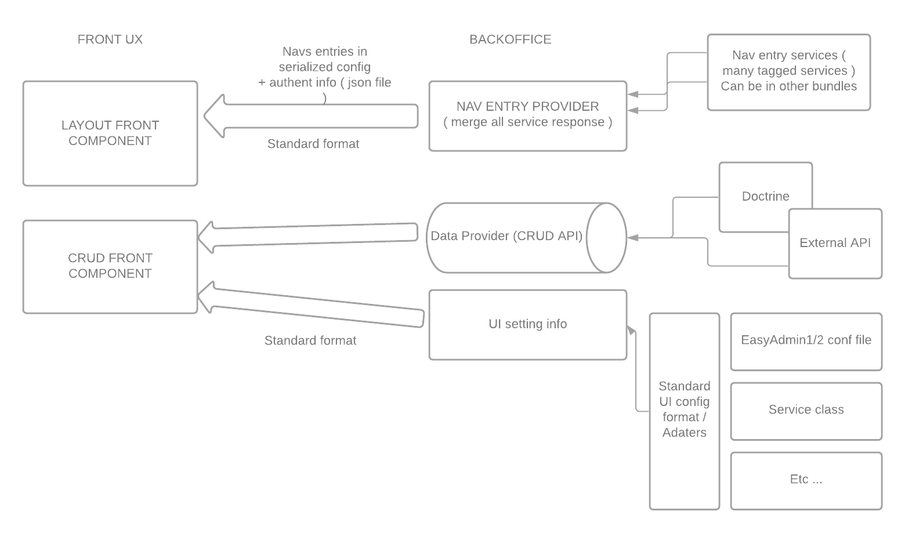

# Crud-it

Crud-it is a standard RAD specification to create business applications.
These application are naively composed by crud screen assembled by a layout and linked together.

There is a lot of tools to génerate such screen in multiple technology. But each techno redefine some vocabulary, redevelop some concept and design.
Maybe some reflexion could be mutualized.

The first objective is to define some standard format to optimise developpement effort for each part of such a complex system.

These standard is techno agnostic.

First we define two main part.

## Frontend

This part it the visible part of the application. It can be an single page app in Vue, Angular or React but it could also be a simple classic template system in php or twig.

The frontend recieve two sort of data.
- parameters data ( UI config, layout, menu entry, etc...)
- business data ( customer, invoice, prices, products, etc... )

these two sort of data are provided in an standardised way ( the format is defined by castor but the serialisation model is free ( json, direct data, xml))

## Backend

This part is responsible to provide the business data and config to manager the way these data should be managed by the user.

The backend could be dispatched in many micro service each responsible for a small part of the application.

For exemple we could build an single CRM / ERP app with part of the interface handled by a CRM micro service and the other by an ERP one.

The system have to respect the separation on concern needed by the business rules.

# Design schema

## 
