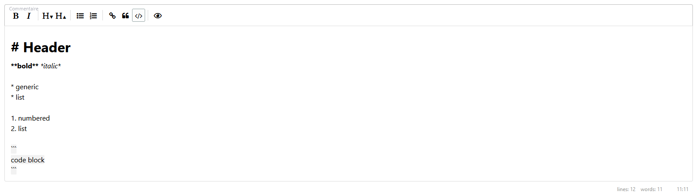

## Markodwn

Crudit support Markdown by providing

- Markdown editor Form Type (`Lle\CruditBundle\Form\Type\MarkdownType`).
- Markdown interpreter for display (`Lle\CruditBundle\Field\MarkdownField`).

### MarkdownType

#### Before

If it's not done yet, install [EasyMDE](https://github.com/Ionaru/easy-markdown-editor) package:

```
npm install easymde
```

then run

````
npm run watch
````

#### Usage

Usage in form builder:

````php
$builder->add('description', MarkdownType::class);
````

The rendering in the form will be:


### MarkdownField

#### Before

Make sure these packages are installed

```
composer require twig/markdown-extra twig/extra-bundle league/commonmark
```

#### Usage

Usage in CrudConfig:

````php
$description = Field::new('description')->setType(MarkdownField::class);
````

The rendering in the page will be:

