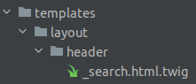
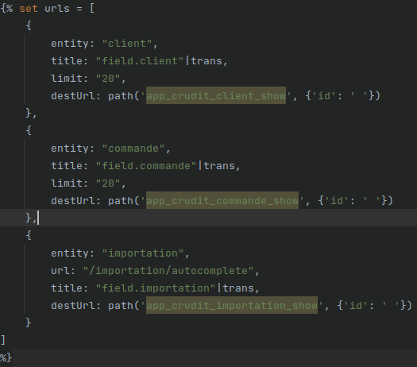
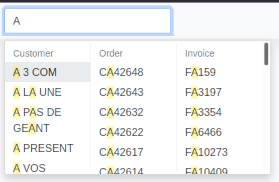

# How to add a multiple search

**1. Create a template**

You need to create a template `_search.html.twig` for example, in `templates/layout/header` folder.



**2. Add a variable urls (which must be an array)**

- In this array you can add all of the urls you want to have in your multiple search.
- For each url you need to define an entity, a title and a destUrl.
- You can too add a limit to determine how many results you want to see (default: 10).

> :warning: if you don't want to use the default url for entity you can define yours with th url option



**3. Add an include**

To make the multiple search work, you must include the following template :

`@LleCrudit/layout/sb_admin/elements/_multisearch.html.twig`

Full example :

```twig
{% set urls = [
    {
        entity: "client",
        title: "field.client"|trans,
        limit: "20",
        destUrl: path('app_crudit_client_show', {'id': ' '})
    },
    {
        entity: "commande",
        title: "field.commande"|trans,
        limit: "20",
        destUrl: path('app_crudit_commande_show', {'id': ' '})
    },
    {
        entity: "importation",
        url: "/importation/autocomplete",
        title: "field.importation"|trans,
        destUrl: path('app_crudit_importation_show', {'id': ' '})
    }
]
%}


```

The result :


